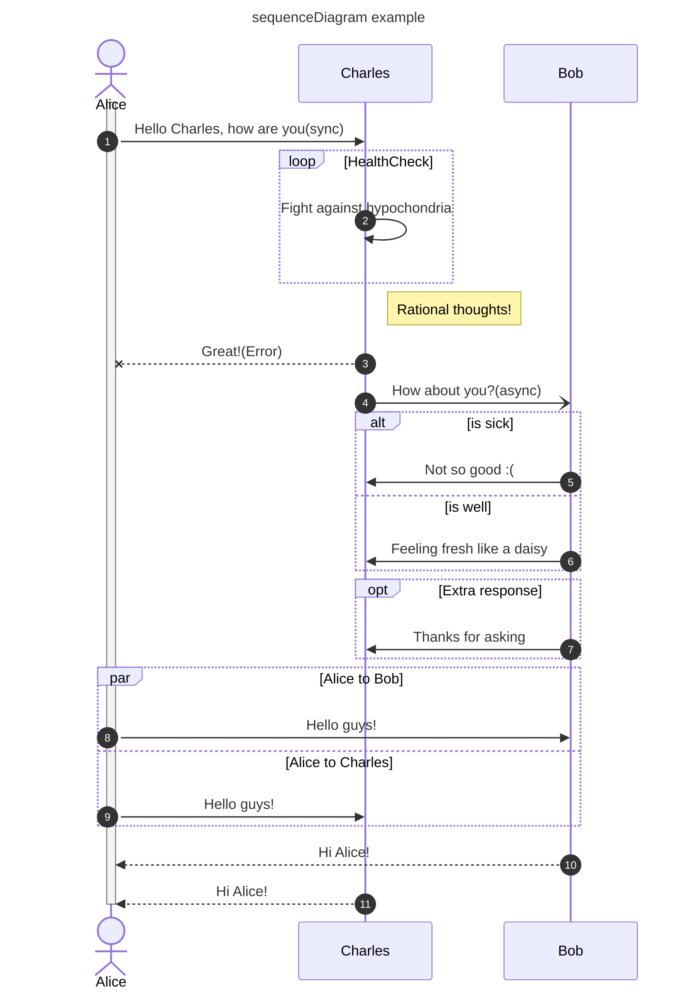
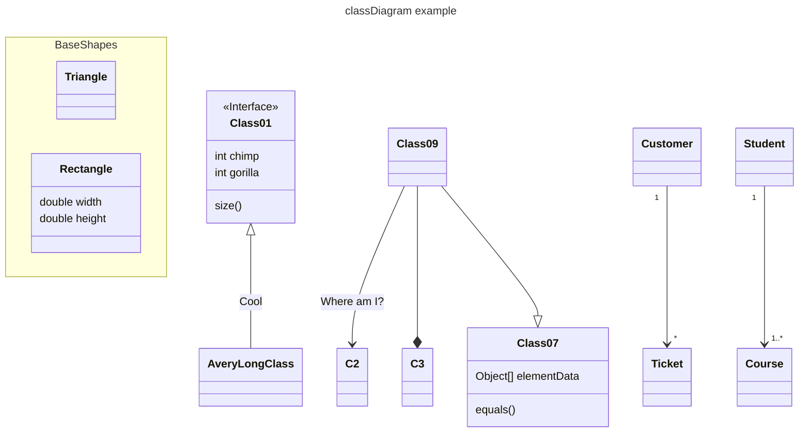
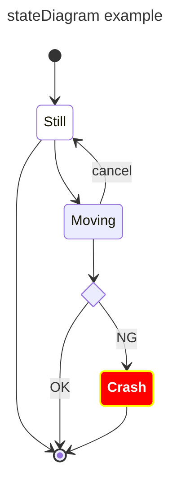
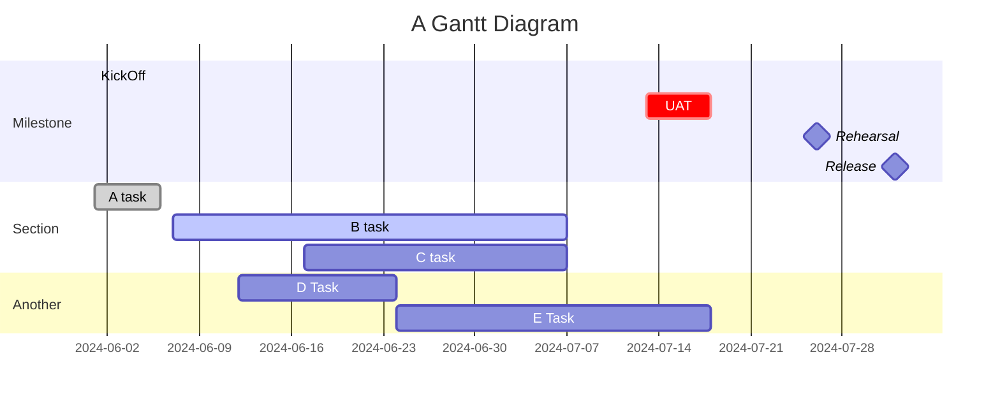
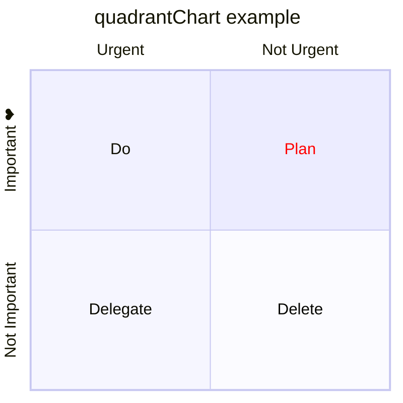
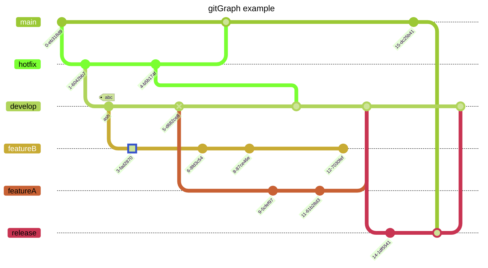

For private documents

<!-- Headers -->
# Headers
# This is an H1
## This is an H2
### This is an H3
#### This is an H4
##### This is an H5
###### This is an H6 

<!-- Blockquotes -->
# Blockquotes
As Kanye West said:

> We're living the future so
> the present is our past.

<!-- Lists -->
# Lists
* リスト1
    * リスト1-2  
* リスト2  

<!-- Decimal -->
#### Ordered List
1. リスト1-1
    2. リスト1-2
2. リスト2  

<!-- Checkbox -->
- [ ] リスト1
- [x] リスト2

<!-- Links -->
# Links
<https://github.com/takaoyuya/doc>
[Repositry](https://github.com/takaoyuya/doc)

<!-- Links -->
# Images


<!-- Emphasis -->
# Emphasis
*Emphasis*
**Emphasis**
***Emphasis***
==marked==

# Abbreviation
*[HTML]: Hyper Text Markup Language
*[W3C]: World Wide Web Consortium
The HTML specification
is maintained by the W3C.

<!-- strike-through -->
# Strike-Through
~~打ち消し~~

<!-- code -->
# Inline code
I think you should use an
`<addr>` element here instead.

<!-- code -->
```
function add(x, y) {
  return x + y;
}
```

# Emoji
:white_check_mark: Dos
:x: Don'ts
:warning:	
:no_entry_sign:	
:bangbang:	
:bomb:

# Alerts
> [!NOTE]
 Highlights information that users should take into account, even when skimming.

> [!TIP]
> Optional information to help a user be more successful.

> [!IMPORTANT]
> Crucial information necessary for users to succeed.

> [!WARNING]
> Critical content demanding immediate user attention due to potential risks.

> [!CAUTION]
> Negative potential consequences of an action.

<!-- Tables -->
# Tables
| Left align | Right align | Center align |
| :--------- | ----------: | :----------: |
| This       |        This |     This     |
| column     |      column |    column    |
| will       |        will |     will     |
| be         |          be |      be      |
| left       |       right |    center    |
| aligned    |     aligned |   aligned    |

<!-- Diagrams -->
# Diagrams
### Sequence diagram
<script>
  mermaid.initialize({ sequence: { showSequenceNumbers: true } });
</script>



### Class diagram


### State diagram


### gantt chart



### quadrant chart


### gitGraph chart



# Footnotes
Content [^1]
[^1]: Hi! This is a footnote

<!-- Extended syntax -->
# Extended syntax
30^th^
H~2~O

### Customize CSS
The style.less file will open, and you can override existing style

### References
[Markdown Preview Enhanced](https://shd101wyy.github.io/markdown-preview-enhanced/#/code-chunk)

[Mermaid](https://github.com/mermaid-js/mermaid)

[GitHub フォーマットの構文](https://docs.github.com/ja/get-started/writing-on-github/getting-started-with-writing-and-formatting-on-github/basic-writing-and-formatting-syntax)

[絵文字チート シート(GitHub)](https://github.com/ikatyang/emoji-cheat-sheet/blob/master/README.md)