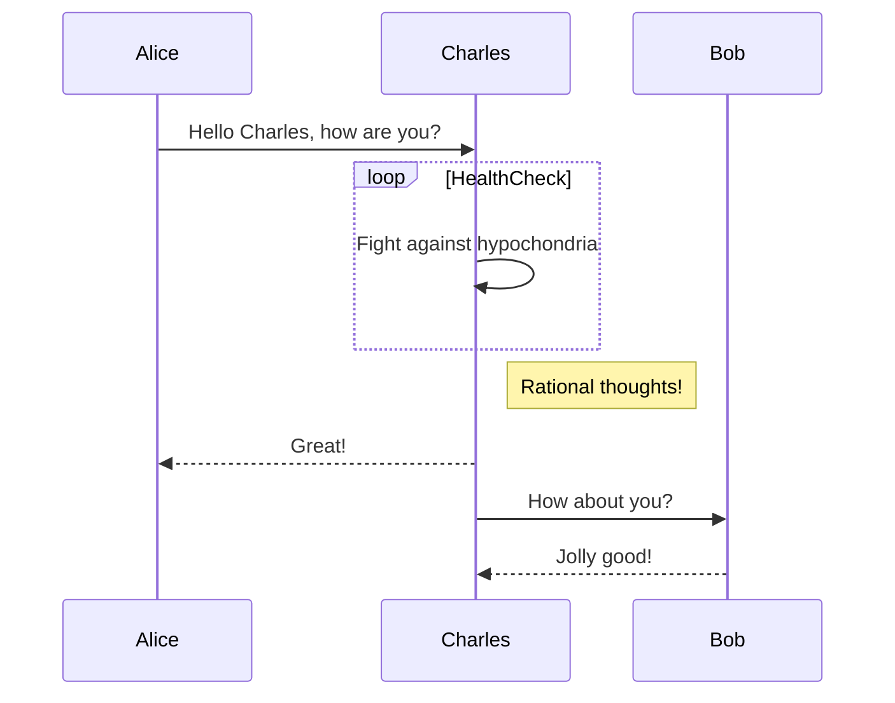
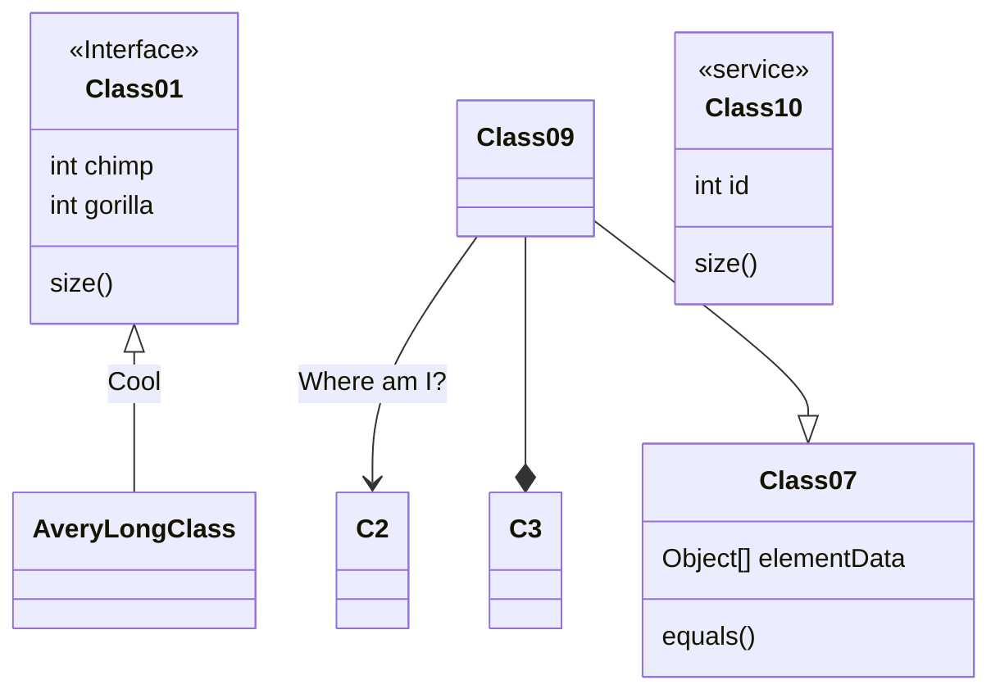
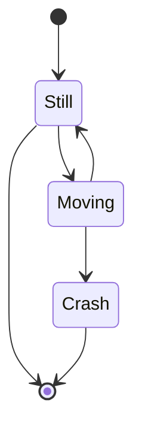
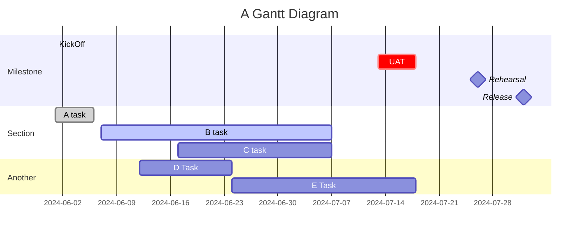

<!-- Paragraphs and Line Breaks  -->
1行目(スペースを2つ入れる)

2行目
Local style

<!-- Headers -->
# Headers
# This is an H1
## This is an H2
### This is an H3
#### This is an H4
##### This is an H5
###### This is an H6 

<!-- Blockquotes -->
# Blockquotes
As Kanye West said:

> We're living the future so
> the present is our past.

<!-- Lists -->
# Lists
* リスト1
    * リスト1-2  
* リスト2  

<!-- Decimal -->
#### Ordered List
1. リスト1-1
    2. リスト1-2
2. リスト2  

<!-- Checkbox -->
- [ ] リスト1
- [x] リスト2

<!-- Horizontal Rules -->

    * * *  
    ***  
    *****  
    - - -  
    ———————————————————

<!-- Links -->
# Links
<https://github.com/takaoyuya/doc>
[Repositry](https://github.com/takaoyuya/doc)

<!-- Links -->
# Images
{width="100px" height="100px"}


<!-- Emphasis -->
# Emphasis
*Emphasis*
**Emphasis**
***Emphasis***
==marked==

# Abbreviation
*[HTML]: Hyper Text Markup Language
*[W3C]: World Wide Web Consortium
The HTML specification
is maintained by the W3C.

<!-- strike-through -->
# Strike-Through
~~打ち消し~~

<!-- code -->
# Inline code
I think you should use an
`<addr>` element here instead.

<!-- code -->
```html:sample
   <div>
      <p>xxx</p>
      <p>yyy</p>
   </div>
```

```ruby
require 'redcarpet'
markdown = Redcarpet.new("Hello World!")
puts markdown.to_html
```

```javascript {.line-numbers}
function add(x, y) {
  return x + y;
}
```

# Footnotes
Content [^1]
[^1]: Hi! This is a footnote


!!! info info "Lorem ipsum"

    Lorem ipsum dolor sit amet, consectetur
    adipiscing elit. Nulla et euismod nulla.
    Curabitur feugiat, tortor non consequat
    finibus, justo purus auctor massa, nec
    semper lorem quam in massa.


!!! note note "Lorem ipsum"

    Lorem ipsum dolor sit amet, consectetur
    adipiscing elit. Nulla et euismod nulla.
    Curabitur feugiat, tortor non consequat
    finibus, justo purus auctor massa, nec
    semper lorem quam in massa.

!!! abstract abstract "Lorem ipsum"

    Lorem ipsum dolor sit amet, consectetur
    adipiscing elit. Nulla et euismod nulla.
    Curabitur feugiat, tortor non consequat
    finibus, justo purus auctor massa, nec
    semper lorem quam in massa.

!!! tip tip "Lorem ipsum"
    Lorem ipsum dolor sit amet, consectetur
    adipiscing elit. Nulla et euismod nulla.
    Curabitur feugiat, tortor non consequat
    finibus, justo purus auctor massa, nec
    semper lorem quam in massa.

!!! success success "Lorem ipsum"

    Lorem ipsum dolor sit amet, consectetur
    adipiscing elit. Nulla et euismod nulla.
    Curabitur feugiat, tortor non consequat
    finibus, justo purus auctor massa, nec
    semper lorem quam in massa.

!!! question question "Lorem ipsum"

    Lorem ipsum dolor sit amet, consectetur
    adipiscing elit. Nulla et euismod nulla.
    Curabitur feugiat, tortor non consequat
    finibus, justo purus auctor massa, nec
    semper lorem quam in massa.

!!! warning warning "Lorem ipsum"

    Lorem ipsum dolor sit amet, consectetur
    adipiscing elit. Nulla et euismod nulla.
    Curabitur feugiat, tortor non consequat
    finibus, justo purus auctor massa, nec
    semper lorem quam in massa.

!!! failure failure "Lorem ipsum"

    Lorem ipsum dolor sit amet, consectetur
    adipiscing elit. Nulla et euismod nulla.
    Curabitur feugiat, tortor non consequat
    finibus, justo purus auctor massa, nec
    semper lorem quam in massa.

!!! danger danger "Lorem ipsum"

    Lorem ipsum dolor sit amet, consectetur
    adipiscing elit. Nulla et euismod nulla.
    Curabitur feugiat, tortor non consequat
    finibus, justo purus auctor massa, nec
    semper lorem quam in massa.

!!! bug bug "Lorem ipsum"

    Lorem ipsum dolor sit amet, consectetur
    adipiscing elit. Nulla et euismod nulla.
    Curabitur feugiat, tortor non consequat
    finibus, justo purus auctor massa, nec
    semper lorem quam in massa.


!!! example example "Lorem ipsum"
    Lorem ipsum dolor sit amet, consectetur
    adipiscing elit. Nulla et euismod nulla.
    Curabitur feugiat, tortor non consequat
    finibus, justo purus auctor massa, nec
    semper lorem quam in massa.

!!! quote quote "Lorem ipsum"
    Lorem ipsum dolor sit amet, consectetur
    adipiscing elit. Nulla et euismod nulla.
    Curabitur feugiat, tortor non consequat
    finibus, justo purus auctor massa, nec
    semper lorem quam in massa.


<!-- Tables -->
# Tables
| Left align | Right align | Center align |
| :--------- | ----------: | :----------: |
| This       |        This |     This     |
| column     |      column |    column    |
| will       |        will |     will     |
| be         |          be |      be      |
| left       |       right |    center    |
| aligned    |     aligned |   aligned    |

<!-- Diagrams -->
# Diagrams
### Sequence diagram



### Class diagram


### State diagram


### gantt chart

sa
<!-- Extended syntax -->
# Extended syntax
30^th^
H~2~O

### Customize CSS
The style.less file will open, and you can override existing style

### References
[Markdown Preview Enhanced](https://shd101wyy.github.io/markdown-preview-enhanced/#/code-chunk)

[Mermaid](https://github.com/mermaid-js/mermaid)
